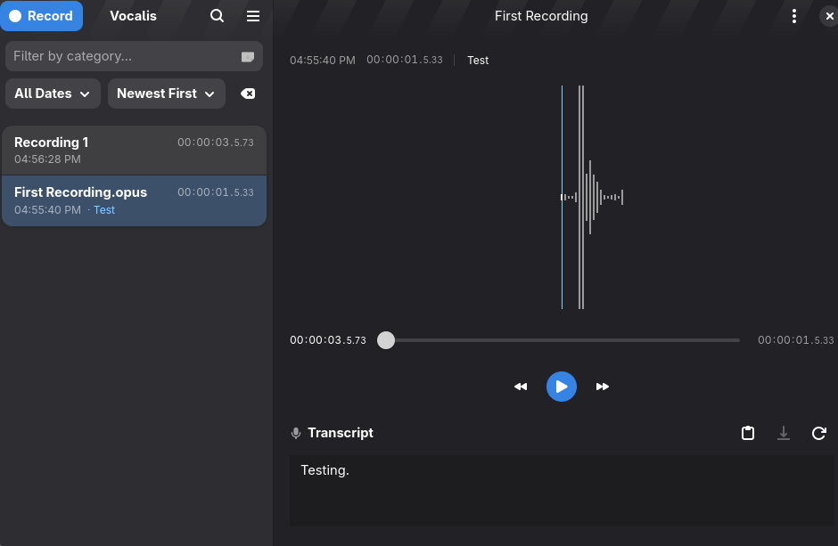

# Transcribd
An audio note taking app with built-in AI transcription via local Lemonade/OpenAI-compatible STT servers.



**Credit:** This project started as a fork of [Vocalis](https://gitlab.gnome.org/World/vocalis) by the GNOME project.


### Features

- **Live Transcription**: Real-time speech-to-text while recording via WebSocket
- **Batch Transcription**: Transcribe existing audio files via HTTP multipart upload
- **Local STT Support**: Works with Lemonade, OpenAI-compatible, or any Whisper-based API
- **Multiple Audio Formats**: Opus, FLAC, MP3, MOV
- **Simple Interface**: Modern GNOME app with Gtk4 and Libadwaita

### Hacking on Transcribd

To build the development version of Transcribd and hack on the code
see the [general guide](https://wiki.gnome.org/Newcomers/BuildProject)
for building GNOME apps with Flatpak and GNOME Builder.

### Contributor Quick Start

Use this if you want to get productive quickly on Linux.

1. Install system dependencies (GNOME + build tools): `meson`, `ninja`, `gjs`, `gtk4`, `libadwaita`, `gstreamer`, `glib2`, Node.js.
2. Install JS dependencies:

```bash
npm install
```

3. Configure the development build:

```bash
meson setup build -Dprofile=development
```

4. Build:

```bash
ninja -C build
```

5. Run in development mode:

```bash
ninja -C build run
```

6. Validate code before opening a PR:

```bash
npm run typecheck
npm run lint
npm run test:local-api
```

If `meson setup` fails because the build dir is stale, recreate it:

```bash
rm -rf build
meson setup build -Dprofile=development
```

### Developer Docs

- [Contributing Guide](CONTRIBUTING.md)
- [Development Guide](docs/DEVELOPMENT.md)
- [Architecture Overview](docs/ARCHITECTURE.md)
- [Flatpak Build Guide](docs/FLATPAK.md)

### Configuration

Set the transcription server URL in the app preferences:
- Default: `http://localhost:8080/api/v1`
- For Lemonade: `http://localhost:13305/api/v1`

Run the test suite to validate your setup:
```bash
npm run test:local-api
```

